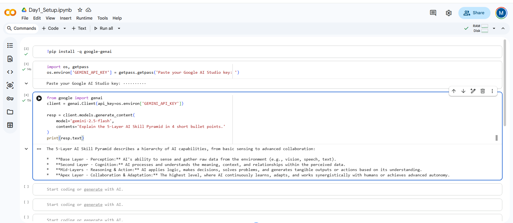

# AI Student Bootcamp — Alajingi Naga Malleswari

Public portfolio of 12-day AI Trainer Workshop. By Day 12: 6 daily notebooks + capstone Streamlit URL.

## Day 1 — Setup complete

- ✅ Google AI Studio API key provisioned
- ✅ Groq API key provisioned
- ✅ Hello-Gemini call working — see [Day1_Setup.ipynb](Day1_Setup.ipynb)
- 4-tool comparison matrix from Lab 1A: see screenshot below

## Day 5 — Resume Scorer

Live URL:
[<your-streamlit-url>](https://ai-student-portfolio-qxriqyfy6vcq4c4g4rurmm.streamlit.app/)

Code:
app.py

Acceptance Log:
acceptance_log.md

Features:
- Fit Score
- Score Breakdown
- Missing Skills
- Suggestions

Reflection:
Built using Streamlit + Gemini
--

# Day 5 Lab 5B — Hugging Face Pulls

## Objective

Compare Hugging Face Inference API and Local Colab inference using transformer models and understand differences in execution speed, setup cost, and usability.

---

## Models Tested

### 1. facebook/bart-large-mnli
- Task: Zero-shot Classification
- Use Case: Resume role prediction

### 2. distilbert-base-uncased-finetuned-sst-2-english
- Task: Sentiment Analysis
- Use Case: Interview response tone analysis

---

## Tasks Completed

- Installed Hugging Face libraries
- Configured Hugging Face token
- Tested Hugging Face Inference API
- Executed local inference using Transformers pipeline
- Performed sentiment analysis
- Compared execution timing

---

## Timing Comparison

| Method | Min Time | Avg Time | Notes |
|--------|----------|----------|-------|
| HF Inference API | DNS Issue | DNS Issue | Endpoint resolution issue |
| Local Colab | YOUR_MIN_TIME | YOUR_AVG_TIME | Initial model download required |

> Replace `YOUR_MIN_TIME` and `YOUR_AVG_TIME` with your actual values.

---

## Sentiment Analysis Results

| Input | Output |
|--------|--------|
| I really enjoyed working on the team | POSITIVE |
| Everyone else was slow | NEGATIVE |
| I learned a lot from my mentor | POSITIVE |
| I had to redo teammate work | NEGATIVE |
| My internship was great | POSITIVE |

---

## Key Learnings

- API inference avoids downloading models locally.
- Local inference requires setup but supports repeated execution.
- Performance depends on hardware and workload.

---

## Reflection

1. Hugging Face API is suitable for lightweight usage.
2. Local inference becomes efficient after setup.
3. Deployment choice depends on cost, latency, and scale.

---

## Challenges Faced

- Hugging Face API DNS issue
- Classifier initialization issue

---

## Resolution

- Continued using local inference
- Loaded classifier before timing evaluation

---

## Final Status

Completed successfully using Local Colab inference.
